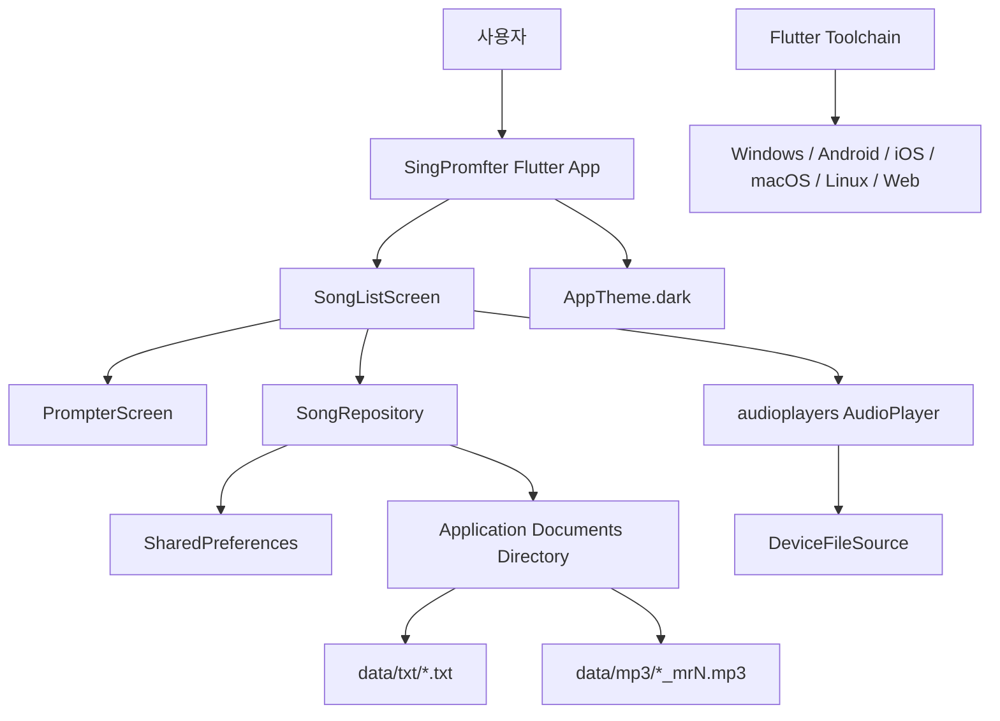

# SingPromfter 아키텍처

작성일: 2026-06-28  
기준 버전: `1.0.0+1`

## 01. 개요

SingPromfter는 Flutter 클라이언트 단독 앱이다. 별도 서버나 인증 계층 없이 로컬 파일 시스템과 SharedPreferences에 데이터를 저장한다. 앱의 핵심 흐름은 곡 메타데이터 로드, 로컬 가사/반주 파일 참조, 오디오 플레이어 상태 구독, 프롬프터 UI 표시로 구성된다.

## 02. 구성도



## 03. 프론트엔드

- 프레임워크: Flutter
- 디자인: Material 3 다크 테마
- 루트 위젯: `SingPromfterApp`
- 메인 화면: `SongListScreen`
- 프롬프터 화면: `PrompterScreen`
- 레거시/보조 화면: `LyricsScreen`
- 상태 관리: 외부 상태관리 라이브러리 없이 StatefulWidget 내부 상태와 repository 호출로 구성

주요 UI 상태:

- 곡 목록
- 예약 큐
- 선택 곡
- 선택 반주 슬롯
- 재생 상태
- 현재 재생 위치/길이
- 프롬프터 설정
- 오디오 준비 상태

## 04. 백엔드 / API

- 원격 백엔드 없음
- HTTP API 없음
- 외부 인증 없음
- 앱 내부 repository가 영속성 계층 역할을 담당

## 05. 데이터 저장소

### SharedPreferences

곡 목록, 설정, 예약 큐, 마지막 선택 곡 ID를 JSON 문자열로 저장한다.

### Application Documents Directory

`path_provider`로 앱 문서 디렉터리를 찾고, 그 아래 `data/txt`, `data/mp3` 디렉터리를 생성한다.

### 레거시 호환

기존 구조의 `lyrics` 및 `mr` 디렉터리를 읽고 삭제 대상으로도 고려한다. `Song.fromJson`은 기존 `mrFileName` 필드를 `BackingTrack(slot: 1)`으로 변환한다.

## 06. 오디오 재생

- 라이브러리: `audioplayers`
- 재생 파일: repository가 찾아준 로컬 mp3 경로
- 상태 스트림을 구독해 UI 재생 상태와 진행률을 갱신한다.
- 곡 완료 이벤트는 예약 큐 처리 트리거로 사용한다.
- 반주가 없거나 파일을 찾지 못하면 사용자에게 SnackBar 안내를 표시한다.

## 07. 배포 / 운영

- Flutter 멀티플랫폼 프로젝트 구조를 유지한다.
- 현재 확인된 빌드 대상: Windows
- Windows 빌드 명령:

```powershell
flutter build windows
```

- 산출물:

```text
build/windows/x64/runner/Release/singpromfter_app.exe
```

## 08. 보안 / 접근성

보안 특성:

- 네트워크 전송이 없어 개인정보 외부 전송면이 작다.
- 사용자가 선택한 로컬 가사/반주 파일을 앱 문서 디렉터리에 복사한다.
- 파일 삭제는 곡 삭제와 연결된 로컬 파일에 한정된다.

접근성 특성:

- 검정 배경과 흰색 텍스트의 고대비 프롬프터
- 노란 강조색 버튼
- 큰 글자 크기 레벨
- 넓은 줄 간격
- 굵게 표시
- 저시력/원거리 프리셋
- 키보드 단축키: Space, F5, Escape

## 09. 주요 리스크와 개선 방향

- 현재 테스트 범위가 placeholder에 가까워 repository와 파일 시스템 동작에 대한 단위 테스트가 필요하다.
- Web은 로컬 반주 파일 복사 제약 때문에 네이티브와 기능 차이가 있다.
- 예약 큐 드래그 재정렬은 문서상 확장 후보이며 현재 구현 범위 밖이다.
- 파일명 기반 저장은 제목 변경 시 복사/삭제 처리가 필요해 회귀 테스트가 중요하다.
- README 기능 버전과 앱 패키지 버전 체계를 정리하면 릴리즈 추적이 더 명확해진다.

