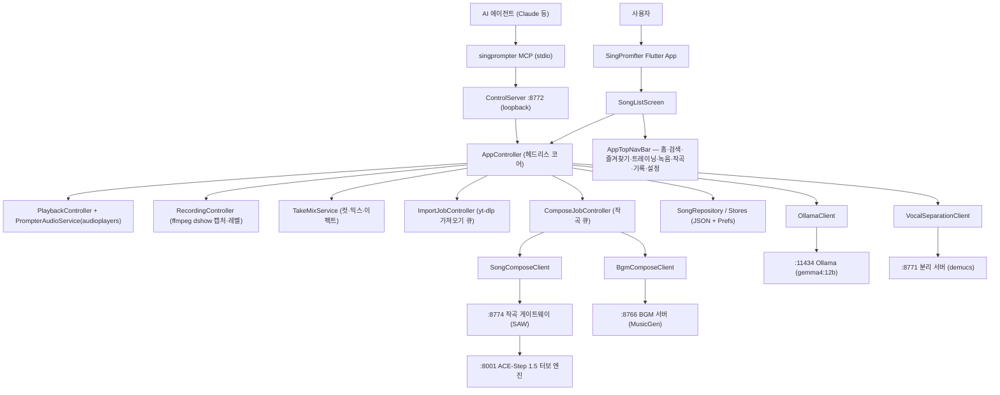

# SingPromfter 아키텍처

작성일: 2026-06-28  
업데이트: 2026-08-08  
기준 버전: `3.0.0` (AI 스튜디오)  
상태: v3.0.0 설계 확정본 — 구현 진행 중 (완료 시 이 줄 제거)

## 01. 개요

SingPromfter는 Flutter Windows 클라이언트 앱이다. 곡 관리·프롬프터·재생은 로컬 파일 시스템과 SharedPreferences로 완결되며, v2.0.0부터 SVIL AI Workstation(SAW)의 로컬 HTTP 서비스(보컬 분리)와 AI 제어용 루프백 API가 붙었고, **v3.0.0에서 녹음 3트랙(보컬·반주·믹스)·믹싱 스튜디오·AI 작곡(ACE-Step 1.5 터보·MusicGen·Ollama)이 추가되어 "개인 AI 스튜디오"로 확장되었다.** 모든 AI 기능은 로컬AI 스위치(기본 꺼짐)로 게이트된다.

## 02. 구성도

```mermaid
flowchart TD
  User["사용자"] --> App["SingPromfter Flutter App"]
  Agent["AI 에이전트 (Claude 등)"] --> MCP["singprompter MCP (stdio)"]
  MCP --> Ctrl["ControlServer :8772 (loopback)"]
  Ctrl --> AC["AppController (헤드리스 코어)"]
  App --> Main["SongListScreen"]
  Main --> TopNav["AppTopNavBar — 홈·검색·즐겨찾기·트레이닝·녹음·작곡·기록·설정"]
  Main --> AC
  AC --> Play["PlaybackController + PrompterAudioService(audioplayers)"]
  AC --> Rec["RecordingController (ffmpeg dshow 캡처·레벨)"]
  AC --> Mix["TakeMixService (컷·믹스·이펙트)"]
  AC --> ImportQ["ImportJobController (yt-dlp 가져오기 큐)"]
  AC --> ComposeQ["ComposeJobController (작곡 큐)"]
  AC --> Repo["SongRepository / Stores (JSON + Prefs)"]
  ComposeQ --> SC["SongComposeClient"]
  ComposeQ --> BC["BgmComposeClient"]
  AC --> OL["OllamaClient"]
  AC --> Sep["VocalSeparationClient"]
  SC --> GW[":8774 작곡 게이트웨이 (SAW)"]
  GW --> ACE[":8001 ACE-Step 1.5 터보 엔진"]
  BC --> BGM[":8766 BGM 서버 (MusicGen)"]
  OL --> Ollama[":11434 Ollama (gemma4:12b)"]
  Sep --> Demucs[":8771 분리 서버 (demucs)"]
```

## 03. 프론트엔드

- 프레임워크: Flutter · Material 3 고대비 다크 (SVIL 표준, `AppTheme`)
- 상태 관리: ChangeNotifier(AppController 등) + ValueNotifier + setState — Provider/Riverpod 없음
- 상단 탭: `AppDestination` enum — 홈 / 곡 검색 / 즐겨찾기 / 트레이닝 / 녹음 / **작곡(v3.0.0)** / 가져오기 기록 / 설정
- 주요 패널: 곡 목록·프롬프터·예약 큐·녹음 보관함(믹스 설정 다이얼로그)·작곡(생성 폼+진행+목록)·설정(녹음/AI 기능/작곡 섹션 추가)
- 로컬AI 꺼짐 시 작곡 탭·AI 분리 옵션은 보이되 비활성(흐림+안내 스낵바)

## 04. 백엔드 / API

| 방향 | 엔드포인트 | 용도 |
|---|---|---|
| 인바운드 | `127.0.0.1:8772` ControlServer (loopback 전용) | MCP(sp_*) 제어 API — 곡·큐·재생·잡·작곡·녹음 |
| 아웃바운드 | `127.0.0.1:8774` 작곡 게이트웨이 | 보컬곡 생성(ACE-Step 1.5 터보) — 잡 제출·상태 폴링·산출물 수신 |
| 아웃바운드 | `127.0.0.1:8766` BGM 서버 | MusicGen BGM 생성(블로킹) — 응답 즉시 산출물 확보 |
| 아웃바운드 | `127.0.0.1:11434` Ollama | 한국어 스타일 프롬프트 → 영어 태그 다듬기 (기본 gemma4:12b) |
| 아웃바운드 | `127.0.0.1:8771` 분리 서버 | AI 보컬 분리(MR 생성·테이크 정리·노래방 세트) |
| 아웃바운드 | `https://lrclib.net` | 싱크 가사 검색 (비AI) |

외부 인증 없음. 유튜브 저작권 고지 승인은 앱 UI에서만 가능(API로 설정 불가).

## 05. 데이터 저장소

Application Documents `data/` 아래:

- `songs.json`(v2) + `txt/`·`lrc/`·`mp3/`(슬롯 1~4 반주)
- `recordings/` + `recordings.json`(**v2** — 보컬 wav·반주 조각 acc·믹스 mix·분리 보컬 sep, 믹스 설정 포함)
- `compose/` + `compositions.json`(**v1 신설** — AI 생성곡 메타+오디오)
- `cache/pitch·levels·keys`(재생성 가능), `practice_log.json`
- SharedPreferences `singpromfter_settings`: PrompterSettings(+입력 장치·게인·로컬/클라우드AI 스위치·Ollama 모델)

## 06. 오디오 파이프라인

- 재생: audioplayers, 키/템포는 ffmpeg(rubberband) 오프라인 변형본
- 녹음: ffmpeg dshow 캡처(입력 장치·게인 설정, RMS 레벨 미터) — 녹음 종료 즉시 실제 재생 파일(변형본 포함)에서 반주 구간을 잘라 자립 보관
- 믹스: acc+보컬 t=0 amix, 밸런스·리버브(aecho 3종)·노이즈 제거(afftdn) 체인
- 작곡: 8774 잡 폴링(VRAM 순번·진행 문구 실표시) / 8766 블로킹 — 산출물은 HTTP /output으로 즉시 확보

## 07. 배포 / 운영

- 대상: Windows. `flutter build windows --release` → `SingPromfter_vX.Y.Z_win64.zip` + GitHub Release
- CI: GitHub Actions — analyze·test·build-windows
- 홈페이지: 루트 index.html → gh-pages 발행(CNAME)
- 외부 도구: ffmpeg·yt-dlp 시스템 설치(경로 자동 탐색+설정 지정)

## 08. 보안 / 접근성

- 네트워크는 loopback(SAW)+LRCLIB만 · 제어 API loopback 바인딩 · 파괴적 MCP 도구 confirm 필수
- AI 기능 기본 꺼짐(로컬AI/클라우드AI 스위치, 켤 때 설치 안내 팝업)
- 고대비 다크·상태는 색+텍스트 병행·50dp 터치 타겟·키보드 단축키·모션 끄기 옵션

## 09. 주요 리스크와 개선 방향

- 보컬곡 생성 3~10분: 게이트웨이 잡 폴링으로 실제 상태 표시, 취소는 클라이언트 포기(서버는 계속될 수 있음 명시)
- 8766은 생성 시 이전 산출물을 삭제 → 응답 즉시 다운로드로 확보
- GPU 경합은 SAW VRAM lease가 직렬화, 앱 큐는 동시성 1
- 다음 버전 후보: 실시간 이펙트 모니터링, whisper 정밀 LRC, 클라우드 LLM 다듬기 확정
